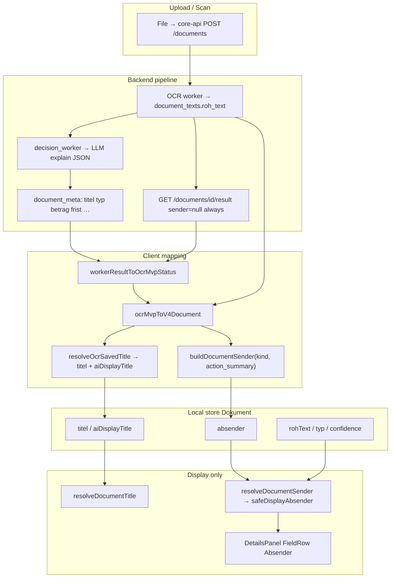

# #189 Absender Extraction / Display Inconsistency — Investigation

**Status:** Audit complete — report only, no code changes  
**Date:** 2026-06-19  
**Trigger:** Screen recording smoke — three sender trust failures  
**Roadmap:** [ASSISTANT_FIRST_ROADMAP.md](ASSISTANT_FIRST_ROADMAP.md) § Phase 1 `#189` (formerly `#187` in early numbering)

---

## 1. Executive summary

BriefPilot can produce a **good document title** and a **bad or missing Absender** for the same document. This is not random UI noise — it follows from an **architectural split**:

| Signal | Primary source today | Persisted in backend? |
|--------|----------------------|------------------------|
| **Title** (`titel`, `aiDisplayTitle`) | LLM `document_meta.titel` → `suggested_title` | Yes (`document_meta.titel`) |
| **Absender** (`absender`) | Client `buildDocumentSender()` on OCR text / structured fields | **No** — not in `document_meta`, not in worker API |
| **Typ** | LLM `document_meta.typ` + client kind mapping | Yes (typ only) |

**Confirmed root cause for “title knows Wasserwerk, Absender fehlt”:** LLM writes a meaningful `titel`; backend never extracts/stores `absender`; client mining fails for utility names like `Wasserwerk Dortmund`; Detail shows **Fehlt** via `resolveDocumentSender` → empty string.

**Confirmed root cause for “Finanzamt on invoice”:** Footer/tax references (`Finanzamt … SteuerNr …`) can win over invoice issuers via (a) unstructured field acceptance in `buildDocumentSender`, (b) authority-first `recoverSenderFromRohText` regex order, or (c) Finanzamt not being classified as a **bad sender** on non-Behörde documents.

**Recommended first PR (low risk):** Display-layer fallback in `resolveDocumentSender` — conservative title-based issuer inference + footer/tax entity demotion. **Second PR:** Persist/parser sender alignment (backend `absender` field or wire parser shadow into meta) — only after display fix proves value.

---

## 2. Current data flow



### 2.1 Extraction (where `absender` originates)

| Layer | Function / module | What it extracts | Production? |
|-------|-------------------|------------------|-------------|
| **LLM explain** | `backend/app/services/llm.py` `EXPLAIN_SYSTEM_DE` | `titel`, `typ`, `betrag`, `frist` — **no `absender` key** | Yes — `decision_worker` |
| **Parser (shadow)** | `local_document_parser._extract_sender()` | Rule-based sender from header/footer lines | Observe-only (`extraction_shadow_mode`) |
| **Client identity** | `buildDocumentSender()` | `vendor_name` / `sender` / form fields / raw_text heuristics | Yes — at save time |
| **Legacy vision** | `analyseText.ts` | First-line heuristics → `Unbekannter Absender` | Camera/diagnose paths only |
| **Legacy classifier** | `DocumentClassifier.extractSender()` | First non-empty line (very naive) | `useDocumentPipeline` augment only |

### 2.2 Normalization & storage

| Step | Location | Behavior |
|------|----------|----------|
| Persist mapping | `ocrMvpToV4Document.ts:242` | `absender: normalizeBuildSender(buildDocumentSender(kind, s))` |
| Canonical brands | `normalizeCanonical()` in `senderNormalization.ts` | Vodafone, Telekom, HUK24, … |
| Weak placeholder | `isWeakSender()` | `Unbekannt`, `Kundenservice`, … → recovery path |
| Store default | `useDocumentPipeline.ts:111` | `absender \|\| 'Unbekannt'` |
| Backend meta | `DocumentMeta` model | **No `absender` column** — `_save_meta()` never writes sender |

### 2.3 Display (where user sees Absender)

| Surface | Resolver | Empty → UI |
|---------|----------|------------|
| Detail Angaben | `resolveDocumentSender(dok)` → `DetailsPanel.tsx:55–68` | `status: 'fehlt'` → label **Fehlt** |
| Home cards | `safeDisplayAbsender` / `resolveDocumentTitle` | Title may show entity; subtitle may not |
| Export filename | `safeDisplayAbsender` | — |
| Kurzfassung / legacy | `summarizeText.ts`, `kurzfassungSync.ts` | `Schreiben von Unbekannter Absender` |

**Display priority chain** (`displaySanitizer.ts:320–327`):

```
aiSender (user accepted)  →  safeDisplayAbsender(absender, confidence, rohText)
                              └─ isWeakSender? → recoverSenderFromRohText(rohText)
                              └─ isLikelyBadDocumentSender? → recover from rohText
                              └─ else normalizeCanonical(absender)
```

**Title priority chain** (`resolveDocumentTitle`):

```
customTitle  →  strong titel  →  aiDisplayTitle  →  offline fallback  →  typ · date
```

Title and sender use **different inputs** — no cross-fallback today.

---

## 3. Root cause hypotheses

| # | Hypothesis | Screen-rec symptom | Verdict |
|---|------------|-------------------|---------|
| H1 | LLM sets `titel` but backend never stores `absender` | Wasserwerk title + Absender Fehlt | **Confirmed** |
| H2 | `buildDocumentSender` raw_text mining misses `Wasserwerk` / utility patterns | Wasserwerk Fehlt | **Confirmed** — frontend recovery lacks `\bwasserwerk\b`; parser has it but not wired |
| H3 | Footer `Finanzamt … SteuerNr` treated as sender | Isolier-Baustoffe invoice shows Finanzamt | **Likely** — authority regex + no invoice guard |
| H4 | Title path uses LLM `suggested_title`; sender path does not | Title good, sender bad | **Confirmed** |
| H5 | `GET /result` hardcodes `sender=None` | Core-api path never passes backend sender | **Confirmed** — `documents.py:342` |
| H6 | `typ=Sonstiges` + weak absender → generic copy | “Sonstiges / Schreiben von Unbekannter Absender” | **Confirmed** — classification + placeholder strings |
| H7 | Stored wrong sender bypasses recovery (non-weak) | Finanzamt shown even when wrong | **Likely** — `Finanzamt Saarlouis` is not `isWeakSender` |

---

## 4. Confirmed findings (with file references)

### F1 — Backend LLM does not extract absender

`EXPLAIN_SYSTEM_DE` JSON schema (`backend/app/services/llm.py:18–40`) lists `titel`, `typ`, `betrag`, … but **no `absender`**. `_save_meta()` (`decision_worker.py:308–320`) inserts only meta fields without sender.

### F2 — Worker API always returns `sender: null`

```342:342:backend/app/api/documents.py
            sender=None,
```

`workerResultToOcrMvpStatus` maps `doc?.sender` → `action_summary.sender` / `vendor_name` (`workerResultToOcrMvpStatus.ts:29–39`). Core-api documents always arrive with null structured sender.

### F3 — Title uses LLM; absender uses client mining only

```107:132:src/features/ocr-mvp/adapters/ocrMvpDocumentIdentity.ts
export function resolveOcrSavedTitle(...) {
  const aiTitle = s?.title?.trim();
  if (isMeaningfulTitle(aiTitle)) {
    return { titel: aiTitle!, aiDisplayTitle: aiTitle };
  }
  // … buildDocumentTitle with optional mined sender for title only
}
```

```237:242:src/features/ocr-mvp/adapters/ocrMvpToV4Document.ts
  const { titel, aiDisplayTitle } = resolveOcrSavedTitle(kind, s, dokumentDatum);
  // …
  absender: normalizeBuildSender(buildDocumentSender(kind, s)),
```

Same `action_summary` object; **different code paths**. LLM title bypasses sender mining entirely.

### F4 — `buildDocumentSender` gaps for utilities

`extractCompanySenderFromRawText` requires `_COMPANY_LINE_RE` (GmbH/AG/…) (`ocrMvpDocumentIdentity.ts:332–407`). Utilities like **Wasserwerk Dortmund** often lack legal suffix → returns `Unbekannt`.

Authority mining in `buildDocumentSender` runs only for `letter | form | settlement` kinds (`_EMPFAENGER_KINDS`, line 434–448). **Invoices** skip `extractAuthoritySenderFromRawText`.

### F5 — Display recovery missing Wasserwerk pattern

`recoverSenderFromRohText` (`senderNormalization.ts:92–104`) includes `stadtwerke`, `gemeinde`, `finanzamt` but **not** standalone `wasserwerk`. Backend parser **does** include `\bwasserwerk\b` (`local_document_parser.py:41`) — eval-only, not client.

### F6 — Finanzamt recovery can fire on wrong document types

`AUTHORITY_RECOVERY_RES` matches `/\b(finanzamt\s+…)/i` globally on `rohText` when `absender` is weak (`senderNormalization.test.ts:104` expects Finanzamt kept when explicitly stored). On **Rechnung** documents, footer tax registration lines can match before issuer GmbH is considered.

`isLikelyBadDocumentSender` (`displaySanitizer.ts:143–147`) blocks Geschäftsführer / Handelsregister but **not** `Finanzamt … SteuerNr` composite strings.

### F7 — Detail “Fehlt” is display-empty, not store-empty

```63:68:src/features/detail/components/DetailsPanel.tsx
    {
      icon: 'buildings', label: T('field.sender'), value: displaySender,
      status: … (!displaySender && !dok.aiSender ? 'fehlt' : …),
    },
```

`displaySender === ''` when `absender` is `Unbekannt` and recovery fails — UI shows **Fehlt** even if `titel` contains issuer name.

### F8 — Sonstiges + Unbekannter Absender cluster

- `KIND_TO_LEGACY` maps `unknown` → `Sonstiges` (`ocrMvpToV4Document.ts:31–38`)
- LLM default typ fallback → `Sonstiges` when uncertain
- `kurzfassungSync.ts:26` substitutes `Unbekannter Absender` in summary strings
- Home dedup key uses raw `absender` (`buildHomeFeedModel.ts:17`) — weak senders collapse many docs

### F9 — Test coverage asymmetry

| Area | Tests exist? | Gap |
|------|--------------|-----|
| `resolveDocumentSender` / footer rejection | Yes — `displayResolvers.test.ts` | No title-cross-fallback |
| `recoverSenderFromRohText` | Yes — `senderNormalization.test.ts` | No Wasserwerk; Finanzamt-on-invoice guard |
| `buildDocumentSender` | **No dedicated unit tests** | Highest-risk function untested |
| `ocrMvpToV4Document` sender | Partial — title tests only | No Wasserwerk / Finanzamt fixtures |
| `local_document_parser` sender | Yes — `test_local_document_parser.py` | Not production path |

---

## 5. Risk ranking

| Risk | Impact | Likelihood | Notes |
|------|--------|------------|-------|
| **R1** Wrong sender shown (Finanzamt on invoice) | High — erodes trust, bad assistant recs | Medium | Footer regex + non-weak stored value |
| **R2** Missing sender despite good title | High — Detail shows Fehlt | High | Architectural split; observed in smoke |
| **R3** Over-aggressive title inference | Medium — false issuer label | Low if conservative | Mitigate with GmbH/utility patterns only |
| **R4** Backend absender persistence | Medium — migration + API change | N/A later | Phase 2; not first PR |
| **R5** Parser rewrite / prompt overhaul | High regression | Low value now | Explicit non-goal |

---

## 6. Minimal fix options

### Option A — UI / display fallback only (recommended first)

**Scope:** `resolveDocumentSender`, `safeDisplayAbsender`, small helpers — **no store writes**.

1. **Title-based conservative inference** when `absender` weak/empty:
   - Parse `aiDisplayTitle` / strong `titel` for known patterns: `… GmbH`, `Wasserwerk …`, `Stadtwerke …`, `Gemeindewasserwerk`
   - Return inferred label with optional `~` prefix or unchanged display (product decision)
   - Only when confidence safe: issuer token appears in title **and** (typ is Rechnung/Mahnung **or** title contains Rechnung/Mahnung/Zahlungserinnerung)

2. **Footer / tax entity demotion:**
   - Extend `isLikelyBadDocumentSender` for `Finanzamt.*SteuerNr`, `USt-IdNr`, `Handelsregister`, `Amtsgericht` when `typ` ∉ Behörde set
   - In `recoverSenderFromRohText`, skip `finanzamt` match when document text/header suggests **Rechnung** / vendor GmbH present earlier in text

3. **Never override** explicit non-weak user/`aiSender` values.

**Pros:** Low risk, immediate Detail/Home improvement, no backend migration.  
**Cons:** Display-only — store/export may still hold `Unbekannt`; inference can miss edge cases.

### Option B — Extraction prompt / entity priority (second PR)

- Add optional `"absender"` to `EXPLAIN_SYSTEM_DE` with rules: “issuer in letterhead, not tax footer, not bank”
- Persist to `document_meta.absender` (migration)
- Return via `WorkerResultDocument.sender`

**Pros:** Single source of truth aligned with `titel`.  
**Cons:** LLM cost/latency; prompt regression risk; needs migration + API + client mapping.

### Option C — Post-processing heuristic at save time

- Enhance `buildDocumentSender`:
  - Add `\bwasserwerk\s+[\w-]+` mining (parity with parser)
  - Reject Finanzamt lines when `_COMPANY_LINE_RE` match exists in first N lines
  - If `s.title` contains issuer and sender weak → derive from title once at persist

**Pros:** Fixes store value for new uploads.  
**Cons:** Does not fix existing docs until re-analyse; touches save path.

### Option D — Combined (recommended sequence)

```
PR #189a (display fallback)  →  PR #189b (buildDocumentSender + save)  →  PR #189c (backend absender, optional)
```

---

## 7. Recommended first PR

**PR `#189a` — Display-layer sender consistency (trust fix)**

| Item | Detail |
|------|--------|
| **Branch suggestion** | `fix/189a-absender-display-fallback` |
| **Files (estimate 3–5)** | `src/utils/displaySanitizer.ts`, `src/utils/senderNormalization.ts`, `src/__tests__/displayResolvers.test.ts`, `src/__tests__/senderNormalization.test.ts` |
| **Out of scope** | `decision_worker`, parser rewrite, schema migration, Detail layout |

**Behavior:**

1. Add `inferSenderFromTitle(title, typ?): string | null` — conservative regex table.
2. Extend `resolveDocumentSender` fallback order:

   ```
   aiSender  →  normalized absender  →  rohText recovery  →  title inference  →  ''
   ```

3. Add `isLikelyTaxOrFooterSender(text, typ?)` — demote Finanzamt+SteuerNr on Rechnung.
4. Add `\bwasserwerk\s+[\wÄÖÜäöüß-]+` to `recoverSenderFromRohText`.

**Do not:** auto-write inferred sender to store in #189a (display-only per safety).

---

## 8. Acceptance criteria

### #189a (display PR)

- [ ] Document with `titel`/`aiDisplayTitle` = `Zahlungserinnerung Wasserwerk Dortmund`, `absender` = `Unbekannt` → Detail Absender shows **Wasserwerk Dortmund** (not Fehlt).
- [ ] Invoice with footer `Finanzamt Saarlouis SteuerNr …` and header `Isolier-Baustoffe Ewen GmbH` → Absender shows **GmbH issuer**, not Finanzamt.
- [ ] Echte Behördenbrief (`typ` Behörde, Finanzamt header) → Finanzamt **still shown**.
- [ ] User `aiSender` and strong stored absender **unchanged**.
- [ ] No new raw technical strings in UI.
- [ ] Jest: ≥6 new cases covering the three smoke scenarios + regression on `displayResolvers.test.ts` footer rejection.

### #189b (follow-up, save path)

- [ ] New uploads persist correct `absender` when title mining would have worked.
- [ ] `buildDocumentSender` unit test file with Finanzamt/Wasserwerk/GmbH fixtures.

---

## 9. Tests to add / update

| Test file | Add |
|-----------|-----|
| `src/__tests__/displayResolvers.test.ts` | Title inference when absender weak; Finanzamt demotion on Rechnung |
| `src/__tests__/senderNormalization.test.ts` | `wasserwerk dortmund` recovery; Finanzamt skipped when GmbH in first 15 lines |
| `src/__tests__/ocrMvpDocumentIdentity.test.ts` (**new**) | `buildDocumentSender` matrix: invoice+GmbH header, utility, authority letter |
| `src/__tests__/ocrMvpToV4Document.test.ts` | End-to-end: worker result with `suggested_title` only → display sender via resolver mock |
| `backend/tests/test_local_document_parser.py` | Already has utility cases — use as **fixture source**, not production change in #189a |

---

## 10. Non-goals

- Full OCR/parser rewrite or shadow-mode routing switch
- LLM prompt overhaul in the first PR
- `document_meta` migration until #189a smoke validates approach
- Detail Intelligence Header / assistant copy (#191)
- Re-analyse / backfill all existing documents (optional later script)
- Legal advice or guaranteed sender correctness claims — keep **prüfen** status when inferred

---

## Appendix A — Screen-rec scenario trace

### Scenario 1: Isolier-Baustoffe Ewen GmbH invoice → Finanzamt Absender

**Likely path:** Footer tax block contains `Finanzamt Saarlouis SteuerNr …`. Either stored directly via `buildDocumentSender` field/raw acceptance, or displayed via `recoverSenderFromRohText` when `absender` is `Unbekannt`. Title may come from LLM (`Rechnung … Ewen` or similar) via F3 — hence title/sender divergence.

### Scenario 2: Wasserwerk Dortmund — good title, Absender Fehlt

**Confirmed path:** LLM `suggested_title` = `Zahlungserinnerung Wasserwerk Dortmund` → `resolveOcrSavedTitle` accepts AI title. `buildDocumentSender` returns `Unbekannt` (no GmbH line, invoice kind skips authority miner, no wasserwerk in client recovery). `resolveDocumentSender` → `''` → **Fehlt**.

### Scenario 3: Sonstiges / Unbekannter Absender

**Confirmed path:** Weak typ classification + `absender` ∈ {`Unbekannt`, `Unbekannter Absender`} + summary/kurzfassung templates. Display title may still be OK if `aiDisplayTitle` set — list cards look inconsistent.

---

## References

| Doc / file | Relevance |
|------------|-----------|
| [ASSISTANT_FIRST_ROADMAP.md](ASSISTANT_FIRST_ROADMAP.md) | #189 trust fix slot |
| `src/features/ocr-mvp/adapters/ocrMvpDocumentIdentity.ts` | `buildDocumentSender`, `resolveOcrSavedTitle` |
| `src/utils/displaySanitizer.ts` | `resolveDocumentSender`, `resolveDocumentTitle` |
| `src/utils/senderNormalization.ts` | Recovery + weak sender |
| `backend/app/api/documents.py` | `sender=None` in worker result |
| `backend/app/services/llm.py` | LLM schema without absender |
| `backend/app/services/local_document_parser.py` | Eval parser sender (reference impl) |

---

*Audit-only. No application code modified in this investigation.*
