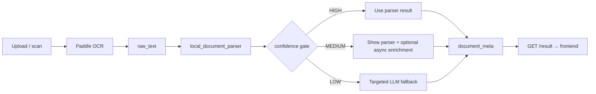

# Parser-First Confidence Gate Design (#163)

> **Status:** Design only — no production routing change.  
> **Trusted main:** `37f8a99e8` (#162 merged)  
> **Related:** [AI_COST_STRATEGY_PLAN.md](AI_COST_STRATEGY_PLAN.md), [EXTRACTION_PROVIDER_EVAL.md](EXTRACTION_PROVIDER_EVAL.md), [CANONICAL_CONTEXT.md](CANONICAL_CONTEXT.md)  
> **Implementation follow-up:** #164 (shadow-mode instrumentation / routing — separate PR)

---

## 1. Purpose & scope

### Why gate now

After the #157 parser improvement arc (#157-A … #157-F, merged #161 + #162), the local parser is strong enough to justify a **confidence gate** design:

| Metric (8 fixtures, parser-only) | Value |
|----------------------------------|-------|
| avg_score | **0.899** |
| valid_json | **1.00** |
| avg_ms | **0.7 ms** |
| amount / deadline / risk / document_type / next_action failures | **0/8 each** |
| sender failures | **1/8** (acceptable safe null — personal Finanzamt letter) |

Operational extraction is clean. Calling an LLM on every OCR result is no longer justified when the parser is confident.

### What this document decides

This PR answers three product/engineering questions **in design only**:

1. **When is the parser result shown directly to the user?**
2. **When is LLM fallback triggered?**
3. **When is a low-confidence warning shown to the user?**

It defines states, thresholds, field criticality, safe-null rules, conflict flags, metrics, and rollout phases. It does **not** change runtime behavior.

### What a future routing PR (#164+) implements

- Gate evaluation function (operational confidence + conflict flags)
- Shadow-mode logging (gate decision vs actual LLM path)
- Feature-flagged parser-first path in `decision_worker`
- Targeted LLM fallback for unresolved fields only

### Explicit out of scope (#163)

- `decision_worker` routing changes
- `local_document_parser.py` logic changes
- Provider selection / LLM client implementation
- Eval scorer / fixture changes
- OCR / Paddle runtime
- Frontend / mobile UX implementation
- Production switch or default provider change
- Sender safety tweak backlog (`/tmp/sender_tweaks_after_161.diff`)
- Fine-tuning / model training

---

## 2. Current production vs target architecture

### Today (unchanged)

Every successful OCR result triggers a full LLM extraction call. Cost scales linearly with volume.

### Target (design intent — not implemented)

**Parser always runs** (no token cost). LLM is **conditional**.

---

## 3. Confidence states

Gate output is one of three states: **HIGH**, **MEDIUM**, **LOW**.

States are derived from **operational confidence** (see §7), conflict flags (see §6), and consistency checks — **not** from title/summary quality alone.

### HIGH — parser-only, no LLM

Accept local parser result. Do not call LLM for extraction.

**Entry criteria (all must hold):**

| Criterion | Rule |
|-----------|------|
| valid_json | Parser output is structurally valid |
| operational_confidence | ≥ **0.80** (see §7) |
| operational fields | Internally consistent (no critical conflict flags) |
| payment documents | `amount` present when document is billing/payment type |
| sender | Present **or** acceptable safe-null (§5) |
| OCR quality | Text length above minimum noise threshold |

**User UX (design):** Show parser fields normally. No blocking warning unless user edits contradict parser.

### MEDIUM — show parser; optional async enrichment

Show parser result immediately. LLM enrichment is **optional and non-blocking** — primarily for UI-quality fields (title, summary).

**Entry criteria:**

| Criterion | Rule |
|-----------|------|
| operational_confidence | **0.60 – 0.79** |
| operational fields | Majority present and non-conflicting |
| title / summary | May be weak or generic — **does not alone downgrade from HIGH** |
| blocking issues | No critical conflict flags |

**User UX (design):** Show parser fields. Soft hint optional (“Weitere Details werden ergänzt” / review nudge). No blocking wait for LLM.

### LOW — targeted LLM fallback

Do not treat parser as authoritative for missing or conflicting operational fields.

**Entry criteria (any may trigger LOW):**

| Trigger | Example |
|---------|---------|
| operational_confidence | < **0.60** |
| payment doc, no amount | Commercial Rechnung, amount null |
| payment deadline required, missing | Mahnung / Bescheid with payment language, deadline null |
| commercial invoice, no sender | Rechnung with amount, sender null (not personal letter) |
| type conflict | `Sonstiges` + amount + payment signals (`zu zahlen`, Rechnungsbetrag) |
| candidate conflict | Unresolved competing amount or deadline candidates |
| OCR noise | Text too short, extreme garbling, empty after strip |
| critical conflict flag | Any flag in §6 marked critical |

**User UX (design):** Show partial parser preview if safe. Indicate review needed. Trigger targeted LLM for unresolved fields only — not full-document replay unless necessary.

---

## 4. Field-criticality matrix

| Field | Operational? | Gate-critical? | Safe-null allowed? | Blocks HIGH alone? | LLM fallback target? |
|-------|:------------:|:--------------:|:------------------:|:------------------:|:--------------------:|
| document_type | Yes | Yes | No (except informational) | Yes, if wrong/conflict | Yes, if LOW |
| amount | Yes | Yes | Only non-payment docs | Yes, on payment docs | Yes |
| deadline | Yes | Yes | Non-payment / no due date | Yes, when payment due expected | Yes |
| risk | Yes | Yes | No | Yes, if inconsistent with type | Rarely |
| sender | Yes | Yes | Personal letters, redacted [NAME] | Yes, on commercial invoice | Yes |
| next_action | Yes | Yes | No | Yes, if wrong (e.g. kalender on payment doc) | Yes |
| title | No (UI) | No | Yes | **No** | MEDIUM+ optional |
| summary | No (UI) | No | Yes | **No** | MEDIUM+ optional |
| evidence / conflict flags | Meta | Yes | N/A | Yes, if critical | Diagnostics only |
| valid_json | Meta | Yes | No | Yes | N/A |

**Design rule:** `title` and `summary` failures (currently 4/8 and 5/8 on fixtures) must **not** prevent HIGH gate or parser-first acceptance. They are enrichment candidates, not operational blockers.

---

## 5. Safe-null rules

### Acceptable null (no gate downgrade)

| Scenario | Field | Rationale |
|----------|-------|-----------|
| Personal / cover letter to authority | sender | `finanzamt_anschreiben_real`: redacted `[NAME]`, no org sender |
| Informational submission, no payment | amount, deadline | No billing obligation |
| Informational letter | next_action `dokument` | User action is archival/review, not payment |
| Gutschrift / credit without due date | deadline | No payment deadline required |

### Not acceptable null (downgrade to MEDIUM or LOW)

| Scenario | Field | Expected gate |
|----------|-------|---------------|
| Commercial Rechnung / Mahnung | sender | LOW if missing |
| Payment Bescheid with amount | sender | MEDIUM minimum |
| Any payment document | amount | LOW if missing |
| Mahnung / payment Bescheid | deadline | LOW if clearly required |
| Utility billing with `zu zahlen` table | document_type `Sonstiges` | Conflict → MEDIUM/LOW |

### Fixture reference

- `finanzamt_anschreiben_real`: sender null → **acceptable** (HIGH possible if other criteria met; current parser confidence low due to title/summary — operational subset may still be HIGH in future gate logic)
- `wasser_real`, `heizoel_real`, `vodafone_real`: sender required for commercial billing context

---

## 6. Conflict flags

Machine-checkable signals the parser (or gate layer) should emit. Critical flags block HIGH.

| Flag ID | Detection idea | Critical? | Typical gate |
|---------|----------------|:---------:|--------------|
| `TYPE_SONSTIGES_WITH_PAYMENT` | `Sonstiges` + amount + `zu zahlen` / Rechnungsbetrag | Yes | LOW |
| `NEXT_ACTION_CALENDAR_ON_PAYMENT` | `kalender` first + amount + Rechnung/Bescheid | Yes | LOW (fixed in #157-F for fixtures) |
| `AMOUNT_MISSING_ON_PAYMENT` | Payment type + amount null | Yes | LOW |
| `DEADLINE_MISSING_ON_PAYMENT` | Payment language + deadline null | Yes | LOW |
| `SENDER_MISSING_COMMERCIAL` | Rechnung/Mahnung + amount + sender null | Yes | LOW |
| `MULTIPLE_AMOUNT_CANDIDATES` | Top candidates within tolerance, unresolved | Yes | MEDIUM |
| `DEADLINE_FORBIDDEN_CONTEXT` | Only Rechnungsdatum, no payment deadline | Medium | MEDIUM |
| `OCR_TEXT_TOO_SHORT` | chars < threshold (e.g. 80) | Yes | LOW |
| `SENDER_PLACEHOLDER_LEAK` | `[NAME]` / address / IBAN returned as sender | Yes | LOW |

Non-critical flags may still surface in MEDIUM with soft user hint.

---

## 7. Threshold policy

### Two scores — do not conflate

| Score | Definition | Used for |
|-------|------------|----------|
| **avg_score** | Eval harness weighted average across all scored fields including title/summary | Regression tracking, #157 progression |
| **operational_confidence** | Parser-emitted confidence weighted toward gate-critical fields only | **Gate HIGH / MEDIUM / LOW** |

**Rule:** A document with avg_score 0.88 but weak title (e.g. `wasser_real`) can still be **HIGH** operationally if amount, deadline, risk, type, sender, next_action are correct and consistent.

### Proposed initial bands (grounded in #157 eval)

Based on parser reaching **0.899 avg_score** with **0/8 operational field failures** on current fixtures:

| State | operational_confidence | Rationale |
|-------|------------------------|-----------|
| **HIGH** | ≥ **0.80** | Above #157-F plateau; operational fields clean on eval set |
| **MEDIUM** | **0.60 – 0.79** | Partial operational signal; enrichment acceptable |
| **LOW** | < **0.60** | Insufficient for parser-first |

These supersede the earlier **0.75** single-threshold idea in [AI_COST_STRATEGY_PLAN.md](AI_COST_STRATEGY_PLAN.md). Final production thresholds must be validated in **shadow mode** (#164) on real traffic — not fixture-only.

### HIGH additionally requires

- `valid_json == true`
- No critical conflict flags (§6)
- Payment consistency rules (§5)

---

## 8. Fallback policy

| Gate state | Parser result | LLM call | Fields sent to LLM |
|------------|---------------|----------|-------------------|
| **HIGH** | Accepted as `document_meta` | **None** | — |
| **MEDIUM** | Shown immediately | Optional, async | `title`, `summary` (and only if enrichment enabled) |
| **LOW** | Partial / provisional | **Yes, targeted** | Missing or conflicting operational fields only |

**LOW fallback must not** re-send full OCR text unless field-targeted extraction fails or document is structurally complex (multi-page legal, nested tables).

### Provider strategy

- **Local parser is always first.**
- **LLM fallback provider order is not finalized in this design PR.**
- Candidate fallback tiers remain:
  - cheapest reliable JSON-capable model
  - Claude Haiku-style reliable low-cost model
  - premium model only for explicit / high-value cases
- **Gemini Flash remains candidate only, not default**, because previous evals showed JSON validity instability and weaker field accuracy vs parser on German fixtures.
- **Final provider choice must be based on** provider eval + `valid_json` + field accuracy + cost + latency — **not assumption**.

See [EXTRACTION_PROVIDER_EVAL.md](EXTRACTION_PROVIDER_EVAL.md) for harness usage. Re-run provider comparison before any routing PR merges.

---

## 9. User-facing confidence UX (design only)

No frontend implementation in #163. Policy for a future UX PR:

| Gate | Badge / copy | Blocking? |
|------|--------------|-----------|
| HIGH | None, or subtle “Erkannt” | No |
| MEDIUM | Soft “Angaben prüfen” only if user-relevant gap | No |
| LOW | Clear review prompt; show which fields are uncertain | Soft block or async fill |

**Principles:**

- Do not show generic “many things wrong” from mid confidence alone when operational fields are correct.
- Separate **low OCR confidence** (Paddle) from **low extraction confidence** (parser gate).
- User corrections are highest-trust signal for threshold tuning.

---

## 10. Metrics to track (pre-rollout)

| Metric | Purpose |
|--------|---------|
| `gate_high_rate` / `gate_medium_rate` / `gate_low_rate` | Gate distribution |
| `llm_fallback_rate` | Cost control |
| `llm_fallback_rate_by_tier` | Provider eval input |
| `parser_skip_rate` | Savings vs today (100% LLM) |
| `field_disagreement_parser_vs_llm` | Shadow mode quality |
| `field_disagreement_parser_vs_user_correction` | Ground truth / false-high |
| `false_high_rate` | HIGH gate but user changed operational field |
| `cost_per_document` | LLM tokens saved |
| `latency_p50_p95_parser_only` vs `full_llm_path` | UX |
| `valid_json_rate_by_provider` | Provider selection input |
| `conflict_flag_frequency` | Parser improvement backlog |

**Shadow mode (#164) must log:** gate state, operational_confidence, conflict flags, parser snapshot, LLM snapshot (if called), final user-saved values.

---

## 11. Rollout plan

| Phase | Scope | Entry | Exit | Rollback |
|-------|--------|-------|------|----------|
| **0 — Design** | This document (#163) | #157 arc PASS | Doc reviewed + merged | N/A |
| **1 — Shadow** | Log gate decision; **still call LLM** (#164) | #163 merged | Stable logs ≥ 2 weeks; false-high bounded | Flag off |
| **2 — Parser-first HIGH** | Skip LLM when HIGH | Shadow false-high < agreed threshold | Cost + accuracy targets met | Feature flag |
| **3 — MEDIUM enrichment** | Optional async title/summary LLM | Phase 2 stable | Enrichment opt-in metrics OK | Per-field flag |
| **4 — Threshold tune** | Expand fixtures + user corrections | Feedback loop live | Re-eval operational_confidence bands | Revert thresholds |

**Shadow mode is mandatory.** No production parser-first switch without Phase 1 evidence.

**#164 is separate** from this doc PR: instrumentation, logging schema, feature flags — not gate policy prose.

---

## 12. Open questions / future work

| Item | Priority | Notes |
|------|----------|-------|
| Title / summary UI-quality PR | Medium | Improves avg_score; non-blocking for gate |
| Sender safety tweak backlog | Low | `/tmp/sender_tweaks_after_161.diff` |
| Real production fixture expansion | High | ≥ 20–30 anonymized German OCR samples |
| Provider re-eval (incl. Gemini, Haiku, others) | High | Before #164 routing |
| `operational_confidence` formula in code | High | #164 implementation detail |
| Mistral eval | Deferred | Not default candidate |
| Fine-tuning | HOLD | Feedback loop first |

---

## 13. #157 baseline reference

Parser improvement arc — field-level diagnostics (#157-A) enabled measured iteration:

| Stage | PR | avg_score | amount | deadline | risk | sender | doc_type | next_action |
|-------|-----|-----------|--------|----------|------|--------|----------|-------------|
| Baseline | #157-A | 0.609 | 3/8 | 2/8 | 2/8 | 5/8 | — | — |
| Amount | #157-B (#158) | 0.672 | **0/8** | 2/8 | 2/8 | 5/8 | — | — |
| Deadline | #157-C (#159) | 0.719 | 0/8 | **0/8** | 2/8 | 5/8 | — | — |
| Risk | #157-D (#160) | 0.750 | 0/8 | 0/8 | **0/8** | 5/8 | — | — |
| Sender | #157-E (#161) | 0.852 | 0/8 | 0/8 | 0/8 | **1/8** | — | — |
| Type + action | #157-F (#162) | **0.899** | 0/8 | 0/8 | 0/8 | 1/8 | **0/8** | **0/8** |

Throughout: `valid_json` 1.00, `avg_ms` < 10 ms (typically ~0.7 ms).

**Remaining non-operational gaps (post-#162):** title 4/8, summary_keywords 5/8 — UI-quality, not gate blockers.

---

## Decision summary

| Area | Decision |
|------|----------|
| Parser operational core | **PASS** |
| Confidence gate design | **GO** (#163) |
| Production routing | **HOLD** → #164+ |
| Shadow mode before switch | **Required** |
| title/summary vs HIGH | **Must not block HIGH alone** |
| Provider default | **Not chosen** — eval-driven |
| Gemini Flash | **Candidate only** — not default |
